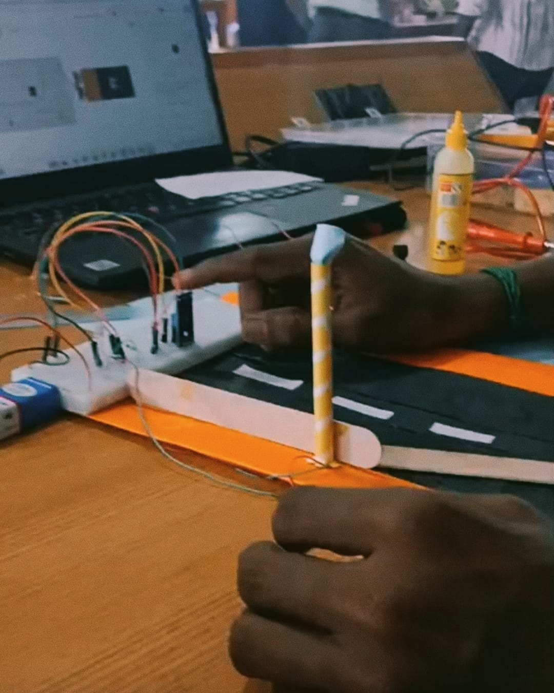

# street-light-LDR# Street Light Using LDR

## Description
This project automatically controls an LED using an LDR.
The LED turns ON in darkness and turns OFF when there is sufficient light.

## Required Components
- LDR
- LED
- Resistor
- NPN Transistor
- Breadboard
- 9V Battery
- Connecting Wires

## Project Setup
The components were connected on a breadboard using the required components.

## Procedure
1. Connected the components on the breadboard.
2. Connected the LDR to the circuit.
3. Connected the LED with the resistor and transistor.
4. Connected the 9V battery.
5. Tested the circuit by changing the light falling on the LDR.

## Functions
- LDR detects the surrounding light.
- LED turns ON in darkness.
- LED turns OFF in bright light.
- The circuit automatically controls the LED based on light intensity.
